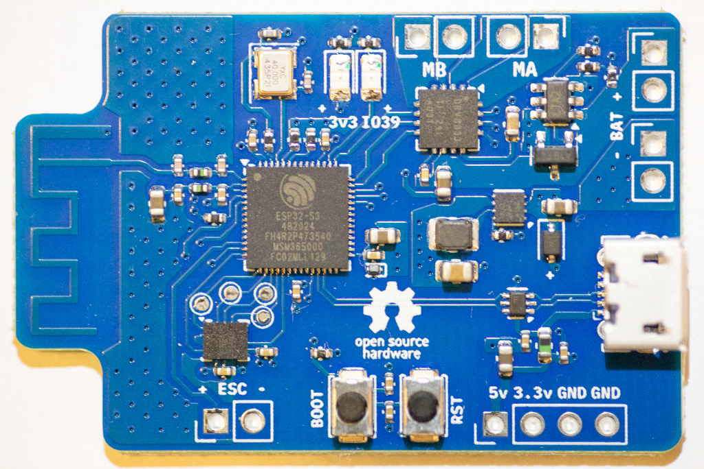
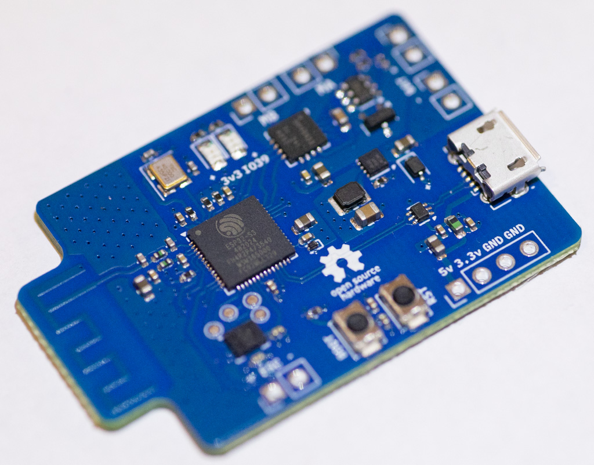

# Robot Controller

## Overview
ESP32-S3 based robot controller designed for combat robots in the 150g weight class

The controller can control 2 DC-motors for vehicle movement and an ESC for the main weapon. The board also embeds a 3-axis gyroscope and accelerometer which can be used to improve vehicle handling or detect when the robot is flipped. Wireless control is enabled through an integrated 2.4GHz PCB-antenna supporting both WiFi and Bluetooth. 

## Schematic and Layout

    
    

[View Schematic (PDF)](documentation/schematic.pdf)

## Firmware
The esp32 firmware is being developed in C using the ESP-IDF framework.
Installation and build instructions from: [ESP-IDF API reference] (https://docs.espressif.com/projects/esp-idf/en/stable/esp32/api-reference/index.html)

