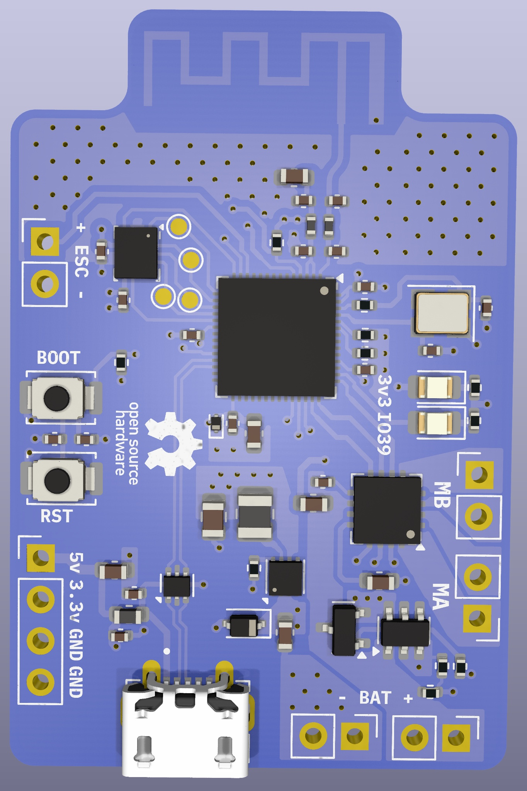

# Robot Controller

## Overview
ESP32-S3 based robot controller designed for combat robots in the 150g weight class

The controller can control 2 DC-motors for vehicle movement and an ESC for the main weapon. The board also embeds a 3-axis gyroscope and accelerometer which can be used to improve vehicle handling or detect when the robot is flipped. Wireless control is enabled through an integrated 2.4GHz PCB-antenna supporting both WiFi and Bluetooth connectivity. 

## Schematic and Layout

    
    

## Firmware

